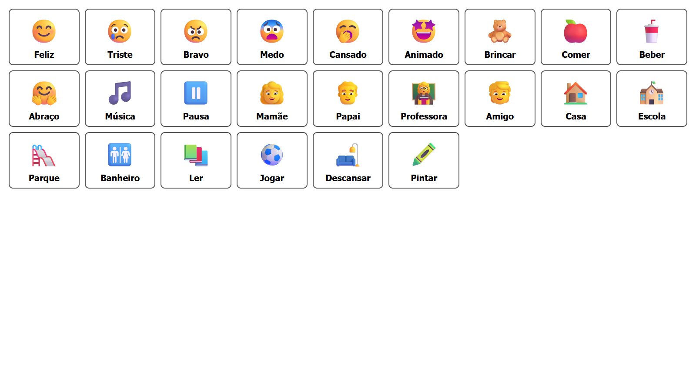

# Comunica Kids

Prancha simples de Comunicação Aumentativa e Alternativa (CAA) para crianças não verbais.

Cada botão exibe um símbolo e uma palavra. Ao clicar, o navegador pronuncia a palavra em português.

## Como usar

Abra o arquivo `index.html` em um navegador moderno.

## Tecnologias

- HTML
- CSS
- JavaScript
- Web Speech API do navegador

## Estrutura

```text
# src/style.css: Estilos dos botões
# src/app.js: Palavras, símbolos e voz
# index.html: Página da prancha
```


> A voz depende do recurso de síntese de fala disponível no navegador e no dispositivo.
